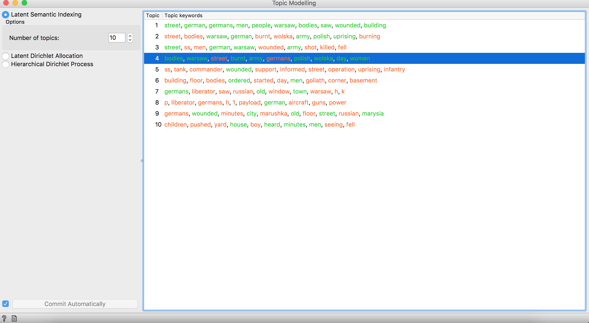

# Initial Findings

In conclusion we were able to come to was obtained through the topic modeling visual from Orange3. We determined tha the Warsaw Uprising website and the data collected had covered from the different perspectives of German, Polish, and Russian. 

The information did not give us the desired conclusion due to several difficulties such as language barriers and lack of proper data formatting. If there was a way to organize the data collected correctly more discoveries could be made. 

---

