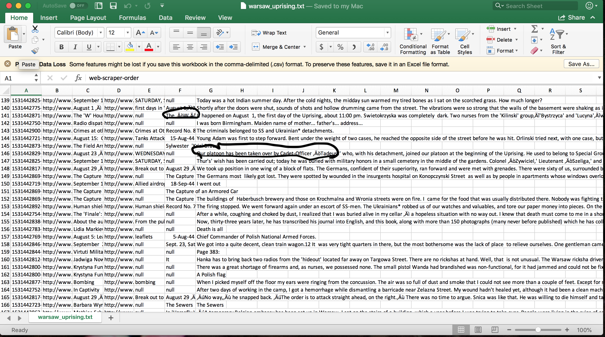

# Problems and Possibilities

As we mentioned before the information acquired by us did not give us the desired conclusion due to several difficulties such as language barriers and lack of proper data formatting. If there was a way to organize the data collected correctly more discoveries could be made.

Our group’s main goal was to analyze text from the eye witnesses during the Warsaw Uprising and comparing it with the both sides of the conflict. A few road blocks we hit were the language barriers where some of the text could not be analyzed due to some words written in Polish and some of the scrapped data was difficult to organize appropriately within the time frame.

The biggest challenge we ran into was creating visuals for the scraped data. In Tableau, we ere able to filter a small portion of the data into dates and locations. In Orange3, the best visuals we were able to create were a simple a simple word cloud and a topic modeling. The only area we did not run into any issues was communication. We used Slack to share our findings and discuss where we could proceed forward with the research. In Github on the-other-hand we have found minimal challenges because we were able to share the work load in posting of our findings in our respective branches.

The problems that stopped us dead in the water was the data collected. Our expectation was scraping the data and uploading into the programs; however, the problems stated above prevented us from moving forward.

The best programs that worked for us was the Webscrapper and Orange3 because we were able to collect enormous amount of historical scholarly data through scraping and experiment with the widgets in Orange3 to analyze and create visual presentation.

Webscraper and Orange3 are programs that could be used in future research.  With more time, we would be able to master Orange3 and fugure out multiple ways to organize data and create stronger visualizations. Webscraper required an extra step to scrub the data appropriately for a clearer analysis. 
