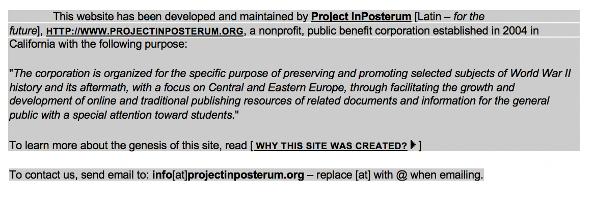

# Source Analysis

We initially searched for any scholarly website that contain the necessary data for the historical event of Warsaw 

Uprising. After checking several websites and searches, we concluded the best website that other sources utilize for research 

is warsawuprising.com. The website is a collection of information about the Warsaw Uprising. On the front page of the website 

shows there are links to: FAQ, timeline, witnesses, photos, movies, songs, and other resources. The resources are linked to 

related articles, books, and other written material that is used to tell the story about the Warsaw Uprising. The organization 

that maintains the website is called “Project InPosterum”.

Since our project thesis centers around the witnesses, we decided to focus on the witnesses page of the website. 

---

## Basic Source Information

* Our source is located http://www.warsawuprising.com/witness.htm
* Our source is a record of the Uprisng and a data table of the major events / witnesses accounts.
* The organization responsible for hosting of our source is Project InPosterum.

---

## Authorship

* Is there any information available discussing the process by which the information was gathered, or how the digital project was constructed?
* How transparent is the project about the choices they made in gathering and transforming the data for digitalization? [Click here for an example of a an excellent 'About' page from a database about Anglo-Saxons](http://www.pase.ac.uk/about/index.html)
* Do the organizations or individuals involved in gathering and publishing your data set have any stated goals or agendas?
* Do the organizations or individuals involved seem to have any unstated agendas or goals?
* If a 3rd party funded the project, who are they? Do they have any particular perspective?

---

## Data Analysis

* Do the datasets involved reflect the viewpoints of particular groups or institutions, and if so, who?
* What kinds of categorizations do you find in the data, and do they seem reasonable?
* Do the means of data collection or categorization affect how the data is constructed in any way?
* Does the website contain any tools for visualizing the data? Do they seem like they are making any kind of arguments?
