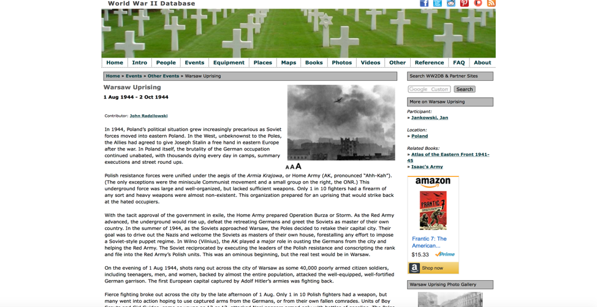
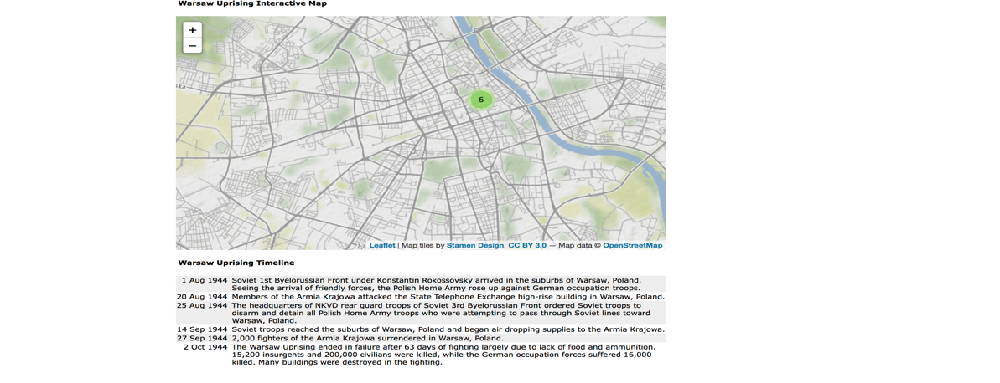
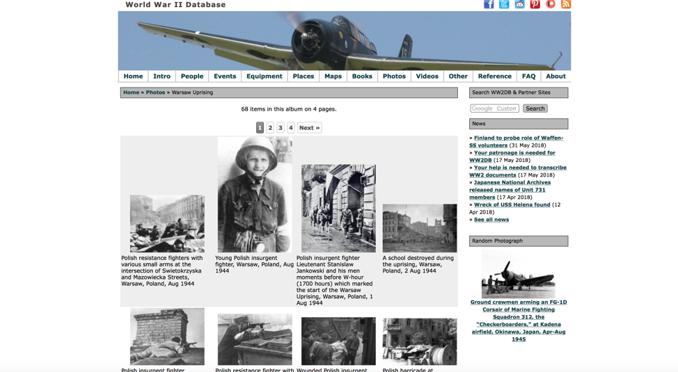

# Source Analysis

We initially searched for any scholarly website that contain the necessary data for the historical event of Warsaw 

Uprising. After checking several websites and searches, we concluded the best website that other sources utilize for research 

is warsawuprising.com. The website is a collection of information about the Warsaw Uprising. On the front page of the website 

shows there are links to: FAQ, timeline, witnesses, photos, movies, songs, and other resources. The resources are linked to 

related articles, books, and other written material that is used to tell the story about the Warsaw Uprising. The organization 

that maintains the website is called “Project InPosterum”.

Since our project thesis centers around the witnesses, we decided to focus on the witnesses page of the website. 

During the initial data search towards the Warsaw Uprising Project, We have discovered the Word War 2 data base – [WW2db.com](https://ww2db.com/battle_spec.php?battle_id=150)

After detail examination of the data base, We have decided to focus on the article and data analysis of John Radzilowski - a professor at the University of Alaska Southeast. John is the author or co-author of many books including Community of Strangers, A Traveller's History of Poland, and The Eagle and the Cross. In 1998, he received the Cavalier's Cross of the Order of Merit from the President of the Republic of Poland.
Also, the detail timeline and described and interactive map showing the events of the Uprising demonstrates the Polish and Soviet movements and measures along the 63 days of the fighting.
His article written mostly from the Polish perspective is a great source of the information and it examines the Warsaw Uprising in the timeline of major skirmishes with the Nazi. 

Furthermore, the [WW2 data base](https://ww2db.com/photo.php?list=search&sp=&startRow=0&keyword=&source=all&color=all&foreigntype=B&foreigntype_id=150&dt=&image_id=) has many authentic photographs from the time of the uprising. Which we will use towards our project

---

## Basic Source Information

* Our source is located at [warsawuprising.com](http://www.warsawuprising.com/witness.htm)
* Our source is a record of the Uprisng and a data table of the major events / witnesses accounts.
* The organization responsible for hosting of our source is Project InPosterum.

---

## Authorship

Website creation link [warsawuprising.com/about](http://www.warsawuprising.com/about.htm)

* There is information discussing how the information was gathered and for what purpose. The link provided above reveals why the site was created.
We are not sure how transparent the project is about the choices they have made, but we would assume that since it is a nonprofit organization and for public benefit. The organization is held accountable and at a high standard.
The organizations goal is to preserve the history of the Warsaw Uprising, which is clearly stated in their website.
We do not believe the organization has any unstated agendas or goals.

## Data Analysis

* The datasets involved reflect the view-points of particular groups i.e. the [Word War 2 Data base](https://ww2db.com/battle_spec.php?battle_id=150) is a perfect example of a Polish Resistence (Armia Krajowa) reflection of the Uprising from a scholar perspecive. On the other hand the [warsawuprising.com](http://www.warsawuprising.com/witness.htm) has view points from the German, Russian and Polish side.
* The website contains very minimum tools for visualizing the data and they are representing clear arguments towards the Uprsing.
