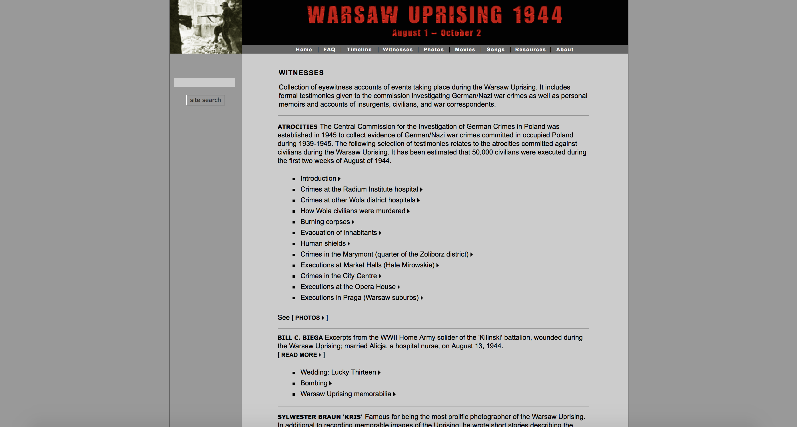
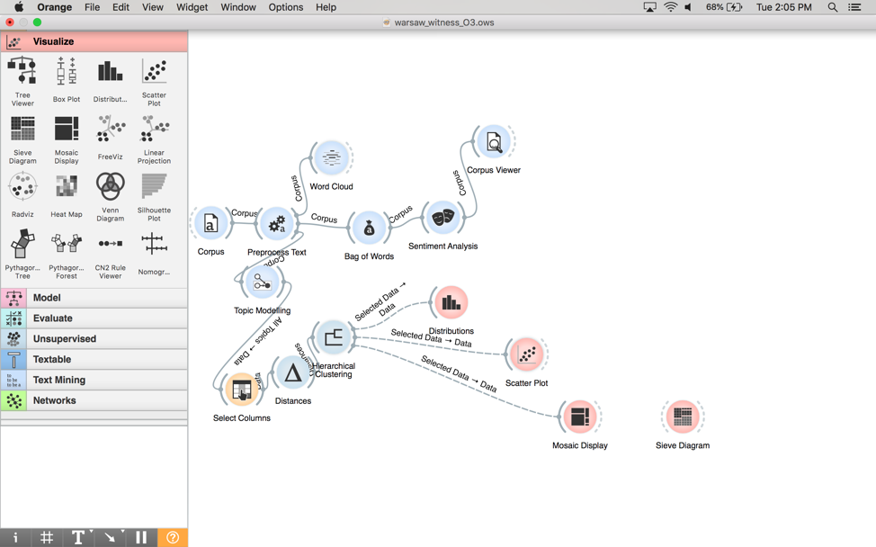
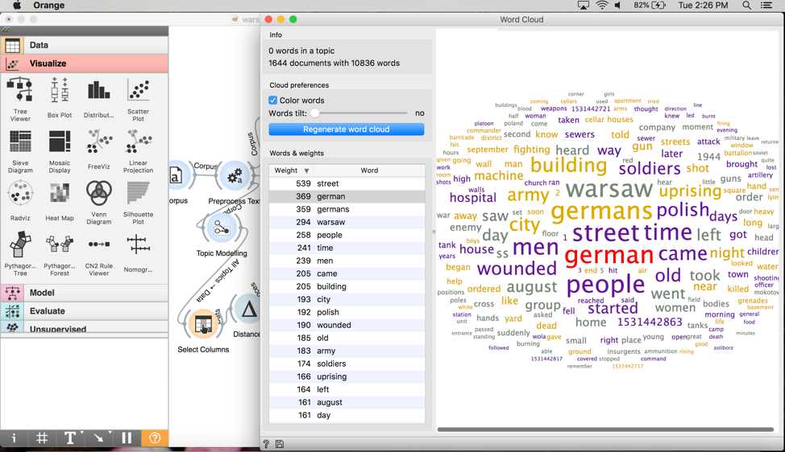
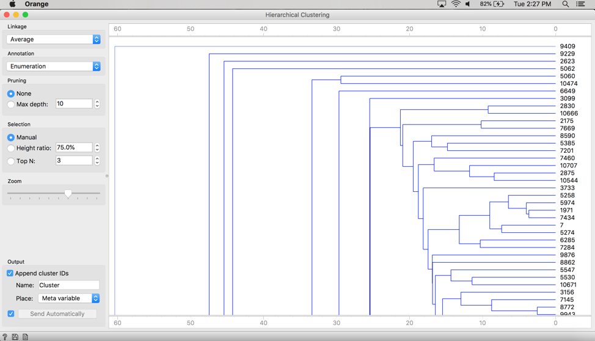
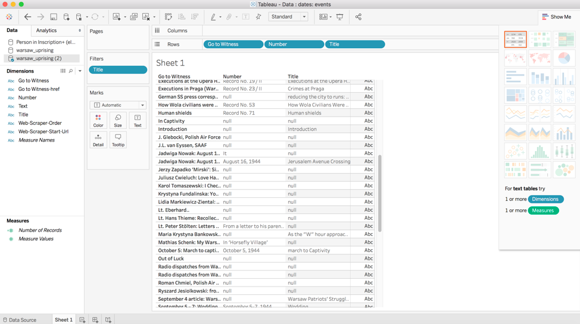
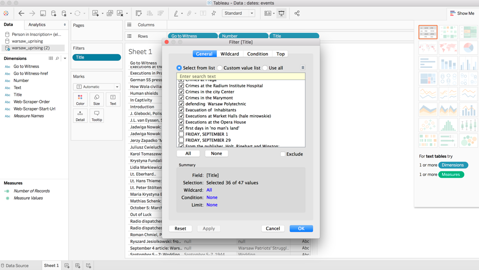

# Workflow

We used Webscraper to scrape data from [WarsawUprisng.com](warsawuprising.com/witnesses). We chose this tool because it is the most efficient way to collect information from the website. 

---

# Orange3

The data scraped from the website was plugged into Orange3. We chose Orange3 because we felt comfortable with the program and after experimenting with it, we were confident that results could be achieved. 

From Orange 3, we used the widgets corpus, preprocess text, topic modeling, distances, hierarchical clustering, and word cloud. 

---

# Tableau

After adding all the scraped data about the Warsaw Uprising I uploaded it as the csv file. Next, I plugged in the data sets and tried to visuals and separate the data via columns, rows by the classification of all the items. Also, also I separated the data to dates, events and the timeline of the major events.

---

